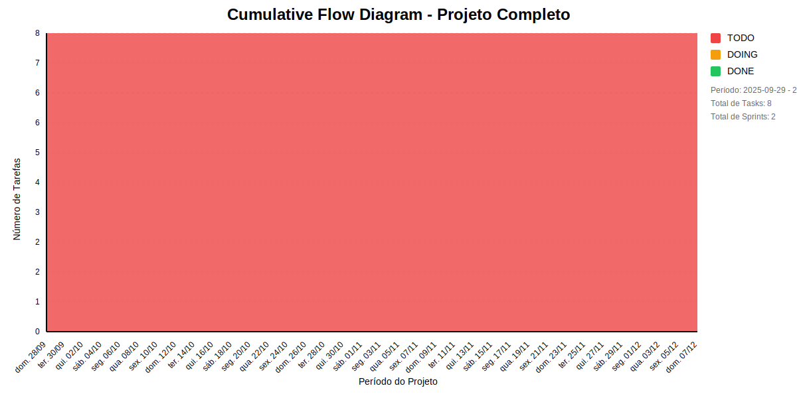

# 📊 Visão Geral do Projeto 

Gerador automático de código
* Data de Início: 2025-08-06
* Data de Planejado: 2025-11-30
* Data de Finalização: 

Gerador automático de código
## Métricas Consolidadas

| Sprint | Período | Duração | Total Tasks | Concluídas | Em Progresso | Pendentes | Velocidade | Eficiência |
|--------|---------|----------|-------------|------------|--------------|-----------|------------|------------|
| Segunda Entrega | 28/09 - 01/11 | 34 dias | 6 | 0 (0.0%) | 0 | 6 | 0/dia | 0.0% |
| Terceira Entrega - C# e Java | 07/12 - 07/12 | 0 dias | 2 | 0 (0.0%) | 0 | 2 | NaN/dia | 0.0% |

## Análise Geral

- **Total de Sprints:** 2
- **Total de Tasks:** 8
- **Taxa de Conclusão:** 0.0%

### Notas
- Período Total: 28/09 - 07/12
- Média de Duração das Sprints: 17 dias

*Última atualização: dezembro de 2025*

## Cumulative Flow 

 ## Previsão do Projeto 

## 🎯 Conclusão Principal

### ✅ PROJETO PROVAVELMENTE SERÁ CONCLUÍDO NO PRAZO

- **Probabilidade de conclusão no prazo**: 100.0%
- **Data mais provável de conclusão**: qui., 11/12/2025
- **Dias em relação ao planejado**: 4 dias
- **Status**: ⚠️ Pequeno Atraso

### 📊 Métricas do Projeto

| Métrica | Valor | Status |
|---------|--------|--------|
| Velocidade Atual | 1.0 tarefas/dia | ❌ |
| Velocidade Necessária | 1.3 tarefas/dia | - |
| Dias Restantes | 6 dias | - |
| Tarefas Restantes | 8 tarefas | - |

### 📅 Previsões de Data de Conclusão

| Data | Probabilidade | Status | Observação |
|------|---------------|---------|------------|
| qui., 11/12/2025 | 100.0% | ⚠️ Pequeno Atraso | 📍 Data mais provável |

## 💡 Recomendações

1. ✅ Manter o ritmo atual de 1.0 tarefas/dia
2. ✅ Continuar monitorando impedimentos
3. ✅ Planejar próximas sprints com antecedência

## ℹ️ Informações do Projeto

- **Total de Sprints**: 2
- **Início**: dom., 28/09/2025
- **Término Planejado**: dom., 07/12/2025
- **Total de Tarefas**: 8
- **Simulações Realizadas**: 10,000

---
*Relatório gerado em 01/12/2025, 22:05:29*